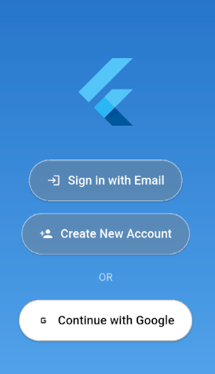
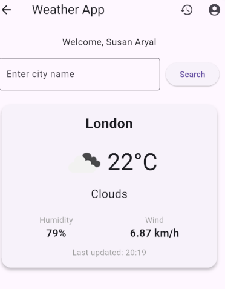
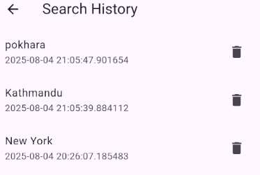

# **Flutter Weather App with Firebase Authentication - Complete Documentation**

## **📌 Project Overview**

A **Weather App** built with **Flutter** that allows users to:  
✅ **Sign in with Email/Password** or **Google Sign-In** (Firebase Authentication)  
✅ **Fetch real-time weather data** (OpenWeatherMap API)  
✅ **Save search history** (Cloud Firestore)  
✅ **View and delete past searches** (CRUD operations)  
✅ **Responsive UI with animations**

---

## **🛠️ Tech Stack**

| **Category**         | **Technology**                     |
| -------------------- | ---------------------------------- |
| **Framework**        | Flutter (Dart)                     |
| **Authentication**   | Firebase Authentication            |
| **Database**         | Cloud Firestore                    |
| **API**              | OpenWeatherMap API                 |
| **State Management** | Built-in (Streams & Providers)     |
| **UI/Animations**    | Material Design, Custom Animations |

---

## **📂 Project Structure**

```
lib/
├── main.dart            (App entry point)
├── screens/
│   ├── auth_screen.dart (Login/Signup UI)
│   ├── weather_screen.dart (Weather display)
│   └── history_screen.dart (Search history)
├── services/
│   ├── auth_service.dart (Firebase Auth logic)
│   ├── weather_service.dart (API calls)
│   └── firestore_service.dart (Firestore CRUD)
├── models/
│   ├── weather_model.dart (Data structure)
│   └── search_history_model.dart (Firestore model)
└── widgets/
    ├── weather_card.dart (Weather UI component)
    └── loading_indicator.dart (Custom loader)
```

---

## **🔧 Setup Instructions**

### **1️⃣ Firebase Setup**

1. **Create a Firebase Project**

   - Go to [Firebase Console](https://console.firebase.google.com/)
   - Click **"Add Project"** and follow the setup wizard.

2. **Enable Authentication**

   - Go to **Authentication → Sign-in Method**
   - Enable **Email/Password** and **Google Sign-In**

3. **Set Up Firestore**

   - Go to **Firestore Database → Create Database**
   - Set security rules:
     ```javascript
     rules_version = '2';
     service cloud.firestore {
       match /databases/{database}/documents {
         match /searches/{document} {
           allow read, write: if request.auth != null;
         }
       }
     }
     ```

4. **Add Firebase to Flutter**
   - Download `google-services.json` (Android) and `GoogleService-Info.plist` (iOS)
   - Place them in:
     - Android: `android/app/google-services.json`
     - iOS: `ios/Runner/GoogleService-Info.plist`

---

### **2️⃣ OpenWeatherMap API Setup**

1. **Get API Key**

   - Sign up at [OpenWeatherMap](https://openweathermap.org/api)
   - Get your **API Key**

2. **Configure in Code**
   - Replace `YOUR_API_KEY` in `weather_service.dart`:
     ```dart
     class WeatherService {
       final String apiKey = "YOUR_API_KEY"; // Replace this
       // ...
     }
     ```

---

## **🚀 Running the App**

1. **Install Dependencies**

   ```bash
   flutter pub get
   ```

2. **Run the App**

   ```bash
   flutter run
   ```

3. **Generate Release APK**
   ```bash
   flutter build apk --release
   ```

---

## **📝 Key Features & Code Explanation**

### **1️⃣ Authentication Flow**

**File:** `auth_service.dart`

- **Methods:**
  - `signInWithEmail()` – Email/Password login
  - `registerWithEmail()` – New user registration
  - `signInWithGoogle()` – Google OAuth login
  - `signOut()` – Logs out user

**Example Usage:**

```dart
final user = await AuthService().signInWithEmail(email, password);
if (user != null) {
  Navigator.pushNamed(context, '/weather');
}
```

---

### **2️⃣ Weather Data Fetching**

**File:** `weather_service.dart`

- **Method:** `getWeather(cityName)`
- **Returns:** `Weather` model with:
  - Temperature
  - Humidity
  - Wind speed
  - Weather condition

**Example API Call:**

```dart
final weather = await WeatherService().getWeather("London");
```

---

### **3️⃣ Firestore Integration**

**File:** `firestore_service.dart`

- **Methods:**
  - `addSearchHistory()` – Saves a city search
  - `getSearchHistory()` – Retrieves past searches
  - `deleteSearchHistory()` – Removes a search

**Example Usage:**

```dart
// Save search
await FirestoreService().addSearchHistory(userId, "Paris");

// Fetch history
final history = await FirestoreService().getSearchHistory(userId);
```

---

### **4️⃣ UI Components**

| **File**              | **Purpose**                           |
| --------------------- | ------------------------------------- |
| `auth_screen.dart`    | Login & Signup UI                     |
| `weather_screen.dart` | Displays weather data + search        |
| `history_screen.dart` | Shows past searches (swipe to delete) |
| `weather_card.dart`   | Custom weather display widget         |

---

## **🔍 Testing & Debugging**

- **Widget Tests:**
  ```bash
  flutter test test/widget_test.dart
  ```
- **Error Handling:**
  - Invalid API key → Shows error message
  - Network issues → Displays retry option
  - Firebase errors → Logs detailed exceptions

---

## **📱 Screenshots (Expected UI)**

| **Auth Screen**                   | **Weather Screen**                  | **History Screen**                  |
| --------------------------------- | ----------------------------------- | ----------------------------------- |
|  |  |  |

---

## **📜 Conclusion**

This project demonstrates:  
✅ **Firebase Auth** (Email + Google)  
✅ **Real-time API Integration** (OpenWeatherMap)  
✅ **Cloud Firestore CRUD**  
✅ **Clean Architecture**

**Next Steps:**

- Add **Dark Mode**
- Implement **Location-Based Weather**
- Improve **Animations**

---

### **📥 Download & Run**

```bash
git clone https://github.com/arsusan/Weather_app_assignment.git
cd weather_app_assignment
flutter run
```

**Enjoy coding!**
